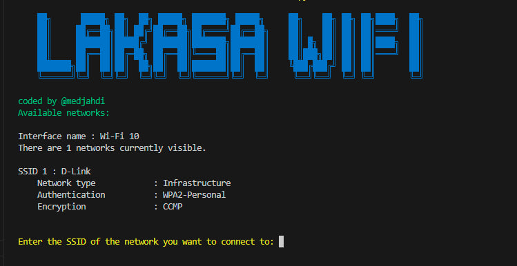

# LAKASA-WIFI

This project is a script designed to connect to Wi-Fi networks using either a wordlist or a randomly generated password. It is intended for educational purposes only.

## Screen Shot 



## Usage

1. Clone the repository:
    ```sh
    git clone https://github.com/medjahdi/LAKASA-WIFI.git
    cd LAKASA-WIFI
    ```

2. Run the script:
    ```sh
    python main.py
    ```

3. Follow the prompts to enter the SSID of the network and choose whether to use a wordlist or generate a random password.

## Features

- **Print Logo**: Displays a logo and title.
- **List Networks**: Scans and lists available Wi-Fi networks.
- **Connect to Network**: Attempts to connect to a specified network using a given password.
- **Wordlist Mode**: Tries passwords from a provided wordlist.
- **Random Password Mode**: Generates and tries random passwords of a specified length.

## 💰 Support the Project

If you find RedTiger useful, consider supporting its development:

<p align="center">
  <a href="https://www.paypal.com/ncp/payment/W5SHTZX6LZH86">
    
  </a>
</p>

## Disclaimer

This script is for educational purposes only. Unauthorized access to networks is illegal. Use this tool responsibly.

## Author

Coded by [@medjahdi](https://github.com/medjahdi)
